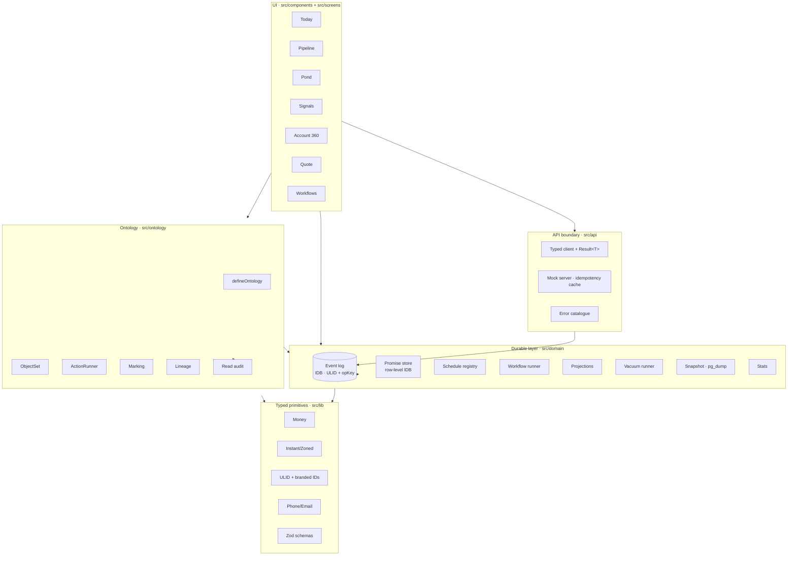

# Spear CRM

[](https://github.com/gdavis1361/spear-demo-crm/actions/workflows/ci.yml)
[](https://github.com/gdavis1361/spear-demo-crm/actions/workflows/codeql.yml)
[](https://codecov.io/gh/gdavis1361/spear-demo-crm)
[](.size-limit.json)
[](LICENSE)
[](.nvmrc)
[](https://www.conventionalcommits.org/)

A CRM rebuilt around how moves actually work. Six screens — Today, Pipeline, Pond, Signals, Account 360, Quote, Workflows — designed for inside reps, AEs, and managers in a PCS-native, corporate-relo, and GSA context.

## Table of contents

- [Run it](#run-it)
- [Architecture](#architecture)
- [Scripts](#scripts)
- [Testing strategy](#testing-strategy)
- [Domain layer (Temporal-style)](#domain-layer-temporal-style)
- [Ontology layer (Palantir-style)](#ontology-layer-palantir-style)
- [Storage layer (Postgres-style)](#storage-layer-postgres-style)
- [Contributing + releases](#contributing--releases)
- [Open follow-ups](#open-follow-ups-not-blocking)

## Run it

```bash
nvm use            # pins to .nvmrc (Node 22)
npm ci             # uses the lockfile
npm run dev        # → http://localhost:5173
```

Or open in [GitHub Codespaces](https://codespaces.new/gdavis1361/spear-demo-crm) — the `.devcontainer/` ships a ready-to-go TypeScript/Node image with Playwright preinstalled.

## Architecture



## Scripts

| Command                      | What it does                                             |
| ---------------------------- | -------------------------------------------------------- |
| `npm run dev`                | Vite dev server with HMR                                 |
| `npm run build`              | Typecheck (`tsc --noEmit`) + production Vite build       |
| `npm run preview`            | Serve the production bundle locally                      |
| `npm run typecheck`          | TypeScript strict-mode typecheck                         |
| `npm run lint`               | ESLint flat config (TS + React + Hooks + jsx-a11y)       |
| `npm run format`             | Prettier write                                           |
| `npm test`                   | Vitest unit tests (primitives)                           |
| `npm run test:watch`         | Vitest in watch mode                                     |
| `npm run test:cov`           | Vitest with v8 coverage (thresholds enforced for `lib/`) |
| `npm run test:e2e`           | Playwright smoke + axe a11y                              |
| `npm run test:visual`        | Playwright pixel-diff regression (expects baselines)     |
| `npm run test:visual:update` | Rewrite the visual baselines (review diff before commit) |

## Directory layout

```
spear-demo-crm/
├── index.html                     ← single entry, preloads above-fold fonts
├── public/
│   ├── assets/                    ← logo SVGs (immutable-cached)
│   ├── fonts/                     ← Instrument Sans WOFF2 (variable)
│   └── manifest.webmanifest
├── src/
│   ├── main.tsx                   ← root: StrictMode + ErrorBoundary
│   ├── App.tsx                    ← shell layout + lazy route switch
│   ├── ErrorBoundary.tsx
│   ├── app/
│   │   └── context.tsx            ← AppProvider / useApp (role, screen, navigate, palette)
│   ├── components/
│   │   ├── shell.tsx              ← Topbar, Rail, Tweaks
│   │   ├── nouns.tsx              ← Noun, Peek, CommandBar, CommandPalette, FocusProvider
│   │   └── extras.tsx             ← ManagerToday/Pond, HonestDraft, Account sub-tabs
│   ├── screens/                   ← one chunk per route (React.lazy)
│   │   ├── today-pond.tsx
│   │   ├── today-focus.tsx
│   │   ├── pipeline.tsx
│   │   ├── signals.tsx
│   │   └── account-quote-workflows.tsx
│   ├── lib/
│   │   ├── types.ts               ← shared domain types
│   │   └── data.tsx               ← typed fixtures
│   └── styles/
│       ├── spear.css              ← tokens (paper + graphite grounds)
│       ├── crm.css                ← app layout + component styles
│       └── nouns.css              ← Noun/Peek/palette styles
├── tests/
│   └── smoke.spec.ts              ← Playwright smoke
├── eslint.config.js               ← flat config
├── playwright.config.ts
├── tsconfig.json                  ← strict: true
├── vercel.json                    ← CSP + security headers + immutable asset cache
└── vite.config.ts
```

### State

- `AppProvider` exposes `role`, `screen`, `setScreen`, `navigate(noun)`, `openPalette()`. No `window.__*` bridges.
- `FocusProvider` manages the single "in-focus" noun and the peek stack. State persists to `localStorage` + URL params (`?focus=kind:id&peek=…`).
- Tweaks persist to `localStorage['spear.tweaks']`; `data-ground` is applied to `<html>`.

### Nouns & verbs

Every entity (person, account, deal, base, signal, doc, rep, lane) is a first-class `<Noun>`. Click = peek drawer; ⌘-click = set focus + peek; Enter/Space on a focused Noun = activate. Verbs re-rank based on `(kind, state, role)` — one source of truth in `VERBS` at [src/components/nouns.tsx](src/components/nouns.tsx).

### Icons

`lucide-react` per-icon imports. **No DOM-scan.** Adding an icon: import it by PascalCase name (`import { Phone } from 'lucide-react'`) and render `<Phone className="ic-sm" aria-hidden="true" />`.

### Keyboard

| Keys              | Action                                                                  |
| ----------------- | ----------------------------------------------------------------------- |
| `g t/p/h/s/a/q/w` | Jump to Today / Pipeline / Pond / Signals / Account / Quote / Workflows |
| `⌘K`              | Open command palette                                                    |
| `⌘⇧F`             | Toggle Today focus mode                                                 |
| `Esc`             | Close peek / palette / clear focus                                      |
| `J` / `K`         | Next / prev card in focus mode                                          |
| `X`               | Mark called + advance                                                   |

### Accessibility

- Skip-link at top of `<body>` focuses `#main`
- All icon-only controls use `<button>` with `aria-label`
- `Noun` implements `role="button"` + `onKeyDown` (Enter/Space)
- `Peek`, `HonestDraft`, `CommandPalette` use `role="dialog"` + `aria-modal` + focus management (first-focus on open, restore on close)
- `CommandPalette` is a proper `combobox` + `listbox` with `aria-activedescendant`
- WCAG AA contrast verified on both paper + graphite grounds

## Deploy

Vercel auto-detects the Vite project. `vercel.json` ships:

- HSTS, CSP, X-Frame-Options, Permissions-Policy, Referrer-Policy
- Immutable `Cache-Control` on `/assets/*` and `/fonts/*`
- SPA rewrite fallback to `index.html`

```bash
vercel --prod
```

## Bundle budget

The main chunk is ~**57 KB gzipped**. Per-route chunks are 2–8 KB gzipped. If a change lifts the initial chunk above 80 KB gzipped, investigate before merging — the most common regression is a barrel import of a large dependency.

## Testing strategy

**Primitives (unit — Vitest)** — every type in `src/lib/` that touches money, time, IDs, contacts, or input validation has table-driven tests. Coverage thresholds: 90% lines/statements/functions, 85% branches. Run on every PR.

**Screens (smoke — Playwright)** — landing, keyboard nav, palette, skip-link. Fast, no screenshots.

**a11y (axe — Playwright)** — Today and Pipeline fail the build on any `serious` or `critical` WCAG 2.1 AA violation.

**Visual regression (pixel-diff — Playwright)** — each of the seven screens plus three overlay states (palette, paper ground, manager role) has a baseline PNG at `tests/visual/**/*-snapshots/`. Fixed viewport 1440×900, frozen clock (2026-04-21T13:47Z), disabled animations, font-ready wait. Diff threshold: 0.2% pixels. To update after an intentional design change: `npm run test:visual:update`, review the diffs, commit the new baselines.

## Domain layer (Temporal-style)

`src/domain/` is the durable layer. State is derived from an append-only event log; nothing important is held in React state alone.

| File                                                | What it owns                                                                                                                           |
| --------------------------------------------------- | -------------------------------------------------------------------------------------------------------------------------------------- |
| [events.ts](src/domain/events.ts)                   | `EventLog` interface + `InMemoryEventLog` (tests) + `IndexedDbEventLog` (browser). Typed `DomainEvent` union per stream.               |
| [deal-machine.ts](src/domain/deal-machine.ts)       | Stage-transition graph with explicit edges. Illegal moves return `stage_transition_invalid` and never reach the wire.                  |
| [promises.ts](src/domain/promises.ts)               | First-class durable timers. localStorage-rehydrated, ticker fires `missed`/`escalated` events. The Today sidebar subscribes.           |
| [schedules.ts](src/domain/schedules.ts)             | Per-source `ScheduleHandle` with cadence, jitter, retry policy, dead-letter, recent-runs history. The Signals page reads it live.      |
| [workflow-def.ts](src/domain/workflow-def.ts)       | `WorkflowDefinition` type + immutable registry. Every flow has an `id` + `version`; in-flight runs pin to the version they started on. |
| [workflow-runner.ts](src/domain/workflow-runner.ts) | `validate` / `dryRun` / `run` / `replay` / `patched()`. The Workflows screen renders from this.                                        |
| [projections.ts](src/domain/projections.ts)         | Pure folds over the event log: `accountActivity`, `dealCurrentStage`, `dealStageHistory`.                                              |

The single most important test is [replay.test.ts](src/domain/replay.test.ts): given a frozen event log, `replay(def, events)` produces a `RunResult` byte-identical to the live `run()` that wrote it. That's the determinism contract.

## Ontology layer (Palantir-style)

`src/ontology/` formalizes the Spear data model. One declaration drives forms, queries, action previews, and the read-audit trail.

| File                                                | What it owns                                                                                                 |
| --------------------------------------------------- | ------------------------------------------------------------------------------------------------------------ |
| [define.ts](src/ontology/define.ts)                 | `defineOntology({ objectTypes, actionTypes })` — validates, builds inverse-link index, returns frozen handle |
| [spear.ts](src/ontology/spear.ts)                   | The actual Spear ontology: 6 object types, bidirectional links, 3 typed actions                              |
| [marking.ts](src/ontology/marking.ts)               | `Marking` enum (low/medium/high/restricted), `canRead`, `MarkingContext`, redaction sentinel                 |
| [property-types.ts](src/ontology/property-types.ts) | `PropertyDescriptor` builders (string/enum/money/instant/email/phone/document/branded id)                    |
| [object-set.ts](src/ontology/object-set.ts)         | Composable, marking-aware, URL-serializable `ObjectSet<T>` query builder                                     |
| [lineage.ts](src/ontology/lineage.ts)               | `DerivedValue<T>` with weight-validated contributors — every spear-score audits back to its inputs           |
| [action-runner.ts](src/ontology/action-runner.ts)   | `previewAction()` / `applyAction()` lifecycle with diff + side-effect summaries                              |
| [audit.ts](src/ontology/audit.ts)                   | `recordObjectViewed` + `recordSetQueried` — the read-audit log                                               |
| [projects.ts](src/ontology/projects.ts)             | `ProjectId` (pod scoping) + `intersects` + `filterByProjects`                                                |

## Storage layer (Postgres-style)

The IDB backend behaves like a small Postgres: connection cached + `onversionchange`-aware, schemas validated on read AND write, ULID primary keys, `UNIQUE (stream, opKey)`, composite indexes, optimistic locking via `appendIf` + `withStreamLock`, persistent dead-letter, hourly idle-time vacuum, snapshot export/import (`pg_dump`-style), `getStorageStats()` (`pg_stat_user_tables`-style). Versioned migrations via `applyMigrations(oldVersion)` — never edit a past block.

## Contributing + releases

- See [CONTRIBUTING.md](CONTRIBUTING.md) for the dev loop, gates, and reviewer rules.
- Commit messages follow [Conventional Commits](https://www.conventionalcommits.org/) — enforced by `commitlint` via the Husky `commit-msg` hook.
- Releases are automated by [release-please](https://github.com/googleapis/release-please): merging the auto-opened release PR cuts a tag, publishes a GitHub Release with auto-generated notes, attaches the tarball + SBOM, and emits SLSA build provenance.
- Security issues: see [SECURITY.md](SECURITY.md). Do not file a public issue.

## Open follow-ups (not blocking)

- Unit coverage for `api/` and `app/` (currently tested via integration + visual)
- Subset Instrument Sans to Latin-Extended glyph set (~40% further font size cut)
- Swap hand-rolled `Peek` / `CommandPalette` for Radix `Dialog` + `cmdk` primitives (a11y for free, less code)
- Lighthouse CI on PRs with budgets (LCP < 1.5s, TBT < 200ms, CLS < 0.05)
- Storybook or Ladle for isolated component review
