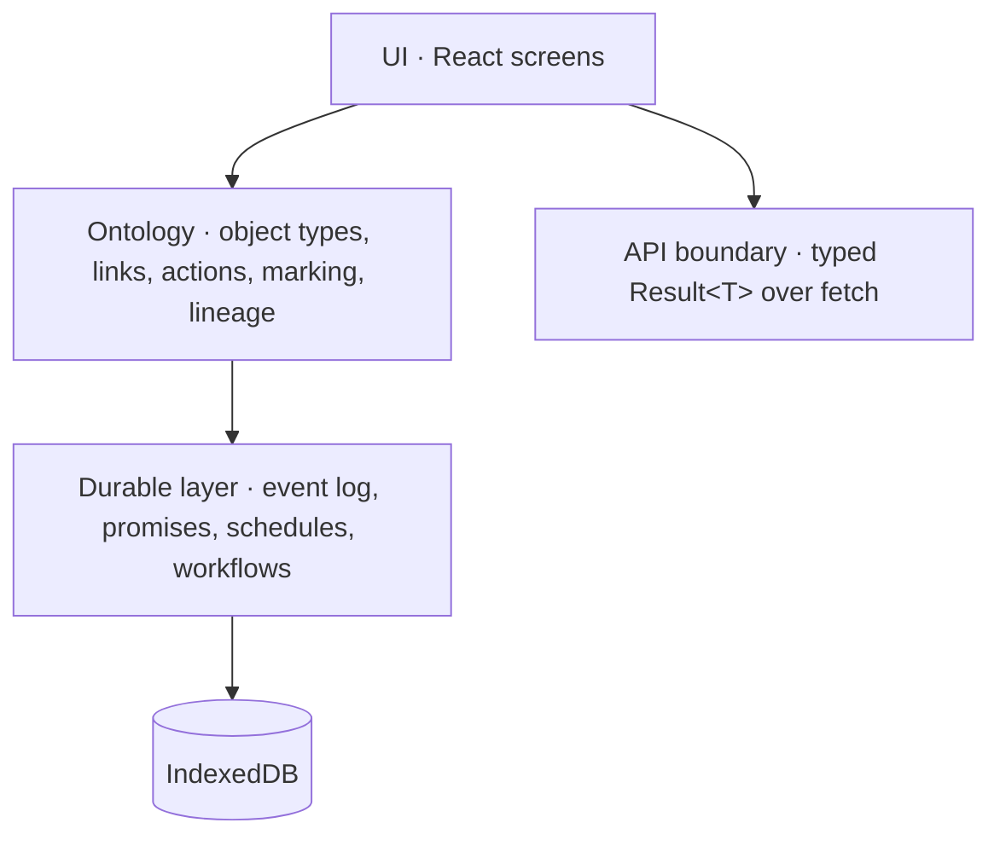

# Architecture

Spear is a layered single-page app. Each layer has one job and a typed boundary above and below it.

## The five layers

- **UI** ([`src/components/`](../src/components), [`src/screens/`](../src/screens)) — read-only consumers of the ontology + domain. Mutations are routed through the API client or through ontology action runners.
- **Ontology** ([`src/ontology/`](../src/ontology)) — typed schema for every object kind, link, action; marking enforcement; lineage on derived values; `ObjectSet` query builder; read-audit.
- **Durable layer** ([`src/domain/`](../src/domain)) — append-only event log, deal state machine, durable promise timers, schedule registry, workflow runner with replay, projections, vacuum, snapshot.
- **API boundary** ([`src/api/`](../src/api)) — typed client returning `Result<T>`, mock server with idempotency cache, error catalogue.
- **Storage** — IndexedDB v4: `events`, `events_dlq`, `promises`, `promises_dlq`, `_legacy_archive`. Versioned migrations via `applyMigrations(oldVersion)`.

## What flows through each boundary

| From → To           | Shape                                                |
| ------------------- | ---------------------------------------------------- |
| UI → Ontology       | typed `defineActionType` invocations + `ObjectSet` queries |
| UI → API            | mutations + side-effects (eventually replaced by ontology actions) |
| Ontology → Durable  | event-log append/read + projections                  |
| Durable → Storage   | strict-durability IDB transactions                   |

## Where to look first

- New to the codebase: [`src/App.tsx`](../src/App.tsx) → [`src/components/shell.tsx`](../src/components/shell.tsx).
- New screen: copy [`src/screens/today-pond.tsx`](../src/screens/today-pond.tsx) and lazy-import in `App.tsx`.
- New object kind: declare in [`src/ontology/spear.ts`](../src/ontology/spear.ts).
- New durable event: add to [`src/domain/event-types.ts`](../src/domain/event-types.ts) + [`src/domain/event-schema.ts`](../src/domain/event-schema.ts).
- New action: add to `src/ontology/spear.ts` and (if it commits state) wire `apply()` to the appropriate durable handler.
