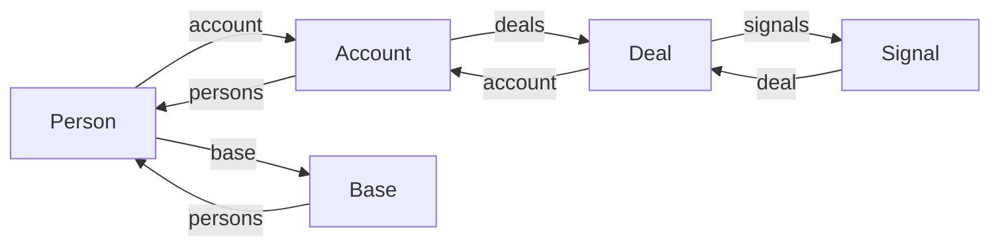

# Ontology

The ontology is the typed schema that every other layer reads from. Adding a new object kind, property, link, or action is a single declaration in [`src/ontology/spear.ts`](../src/ontology/spear.ts).

## Object types

Six declared kinds:

| Kind      | Primary key | Marking  | Notes |
|-----------|-------------|----------|-------|
| `person`  | `id`        | medium   | PII; `email` + `phone` are `high` |
| `account` | `id`        | medium   | corporate / mobility account |
| `deal`    | `dealId`    | medium   | `bafoDraft` is `high` |
| `base`    | `id`        | low      | military base |
| `signal`  | `id`        | medium   | inbound intel event |
| `promise` | `id`        | low      | a durable promise the rep made |

## Links

Every link is bidirectional. Declaring `Person.account → Account` (with `inverse: 'persons'`) auto-builds the reverse index, so `Account.persons` is queryable without a sequential scan.



## Actions

Action types capture *intent*, not just labels. Each one declares its parameter schema, preconditions, marking, allowed roles, and a pure `preview()` that returns `{ diff, sideEffects }`. The UI calls `previewAction()` first, shows the preview to the user, and only then calls `applyAction()`.

| Action ID            | Applies to | Marking | Roles            |
|----------------------|------------|---------|------------------|
| `deal.advance`       | `deal`     | low     | rep, ae, mgr     |
| `deal.send_bafo`     | `deal`     | high    | ae, mgr          |
| `signal.dismiss`     | `signal`   | low     | rep, ae, mgr     |

## Marking

Four levels: `low` < `medium` < `high` < `restricted`. A viewer's `MarkingContext.clearance` is checked against:

- the object's marking (`canRead` gates whole-object access),
- each property's marking (under-cleared → property redacts to `'⊘'`),
- each action's marking (under-cleared → action absent from the verb list).

Marking is enforced at the projection layer, not the UI. A future SIEM-style audit hook will flag any read attempt that fell through to a redaction.

## Lineage

Every derived value is wrapped in `DerivedValue<T>` carrying its model, version, refresh timestamp, and weighted contributors. The Today queue's spear-score uses this — hover to see why a card is ranked where it is.

```ts
{
  value: 96,
  lineage: {
    model: 'spear-priority',
    version: 3,
    refreshedAt: { iso: '2026-04-21T08:30:00Z' },
    contributors: [
      { source: 'callback_promise_minutes_to_due', label: '...', weight: 0.42, objectRef: 'promise:pr_alvarez' },
      // ...
    ],
  },
}
```
