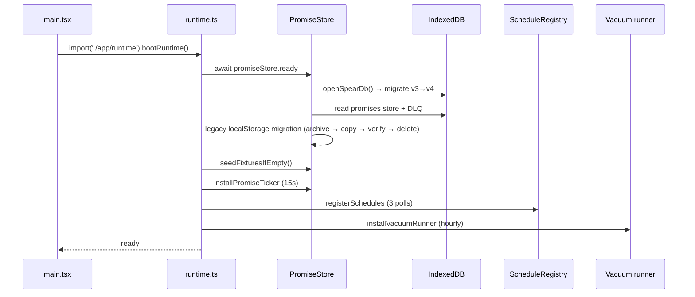

# Runtime

The runtime layer ([`src/app/runtime.ts`](../src/app/runtime.ts)) wires the durable singletons to the React tree. `main.tsx` calls `bootRuntime()` exactly once before render.

## Boot sequence

## Singletons

| Singleton           | Location                                    | Purpose                                          |
| ------------------- | ------------------------------------------- | ------------------------------------------------ |
| `eventLog`          | [`src/domain/events.ts`](../src/domain/events.ts) | append-only event log over IDB                   |
| `promiseStore`      | [`src/domain/promises.ts`](../src/domain/promises.ts) | row-level IDB promise store with cross-tab sync |
| `scheduleRegistry`  | [`src/domain/schedules.ts`](../src/domain/schedules.ts) | per-source cadence + retry + dead-letter         |
| `runHistory`        | [`src/app/runtime.ts`](../src/app/runtime.ts) | recent workflow runs (in-memory; persisted via event log) |
| `vacuumRunner`      | [`src/domain/vacuum-runner.ts`](../src/domain/vacuum-runner.ts) | hourly idle-time TTL deletion                |

## Storage shape

IndexedDB v4 — five object stores:

| Store              | Key path | Indexes                                              |
| ------------------ | -------- | ---------------------------------------------------- |
| `events`           | `id`     | `stream_id`, `opkey_unique` (unique), `kind`         |
| `events_dlq`       | `id`     |                                                       |
| `promises`         | `id`     | `status_due`, `due`, `updated_at`                    |
| `promises_dlq`     | `id`     |                                                       |
| `_legacy_archive`  | `key`    | (originals of pre-v3 localStorage blobs)             |

All `readwrite` transactions use `{ durability: 'strict' }`.

## Cross-tab story

- `BroadcastChannel('spear:events')` posts after every successful event-log append.
- `BroadcastChannel('spear:promises')` posts after every promise upsert/delete/clear.
- `navigator.locks.request('spear:<stream>')` serializes deal transitions across tabs (no-op fallback in browsers without Web Locks).
